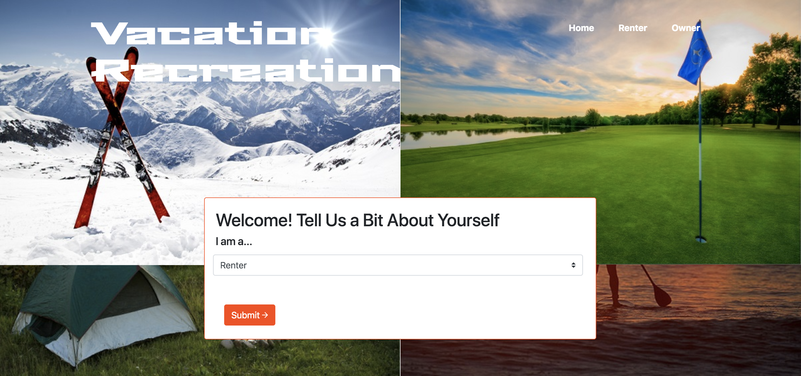
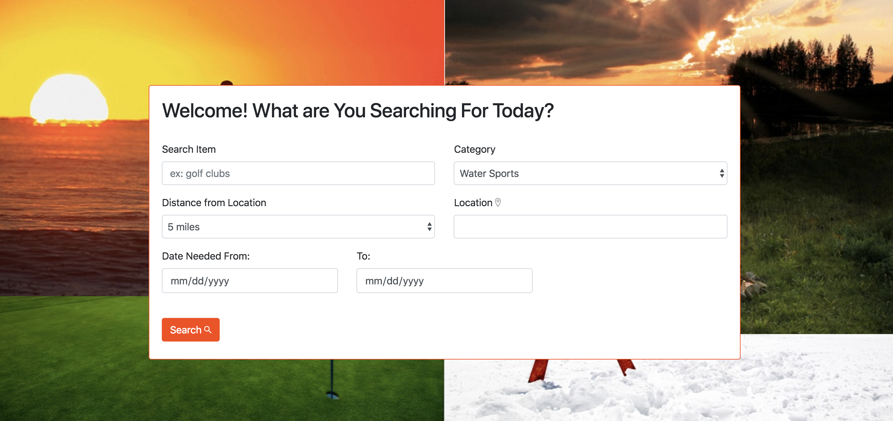
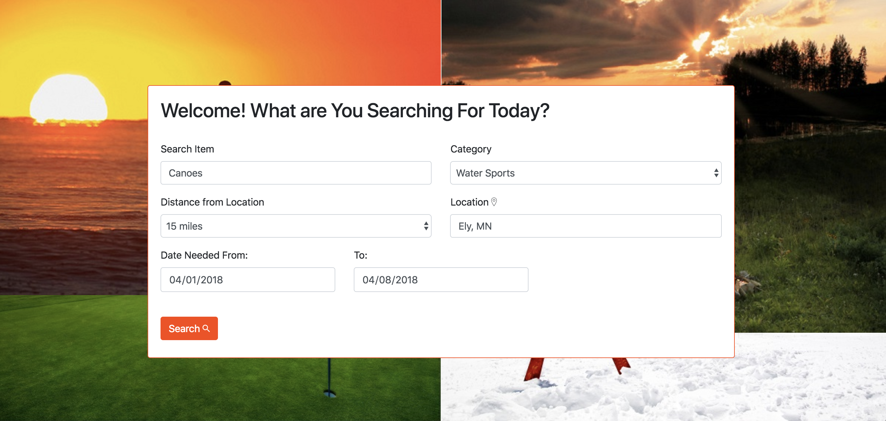
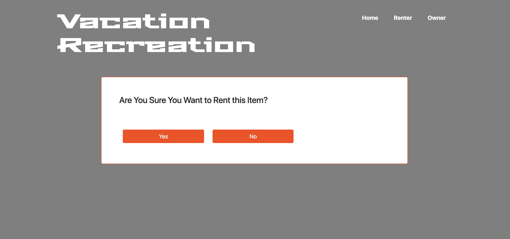
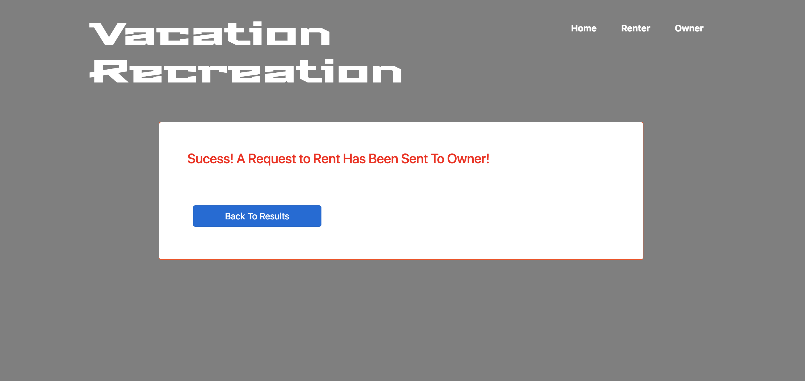
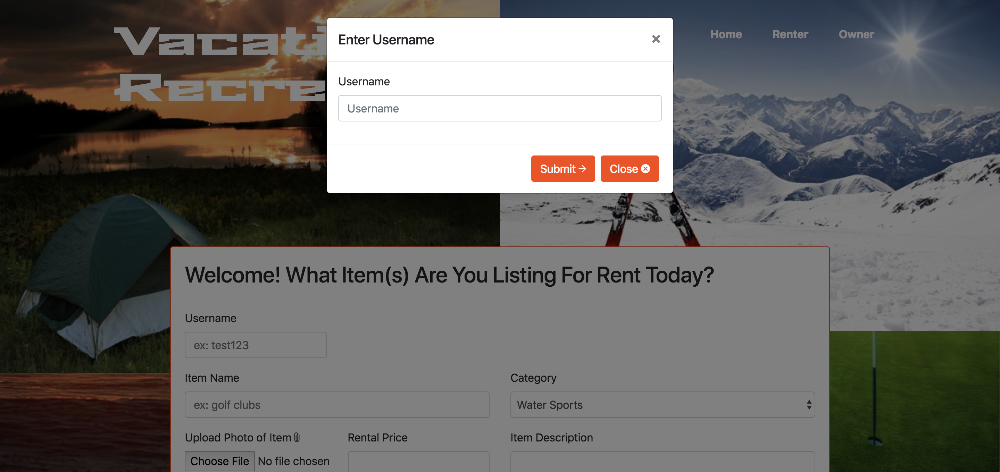
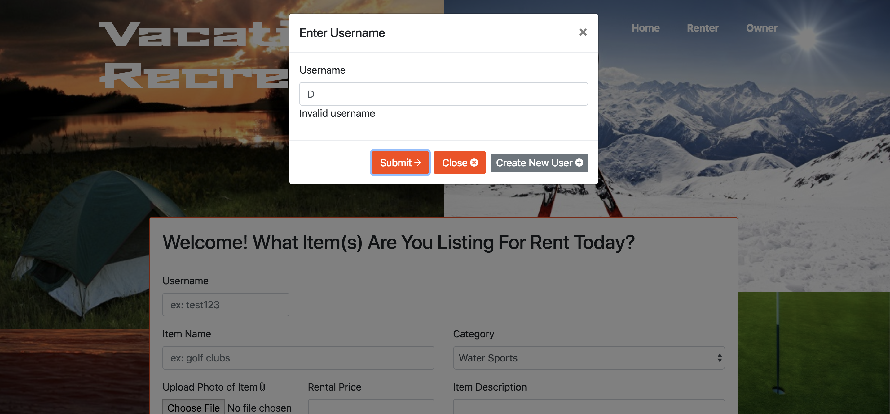
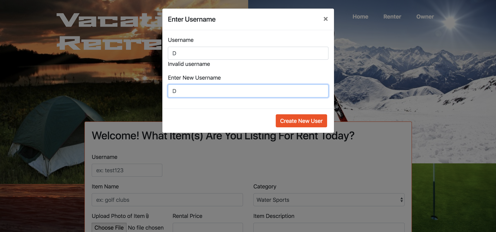
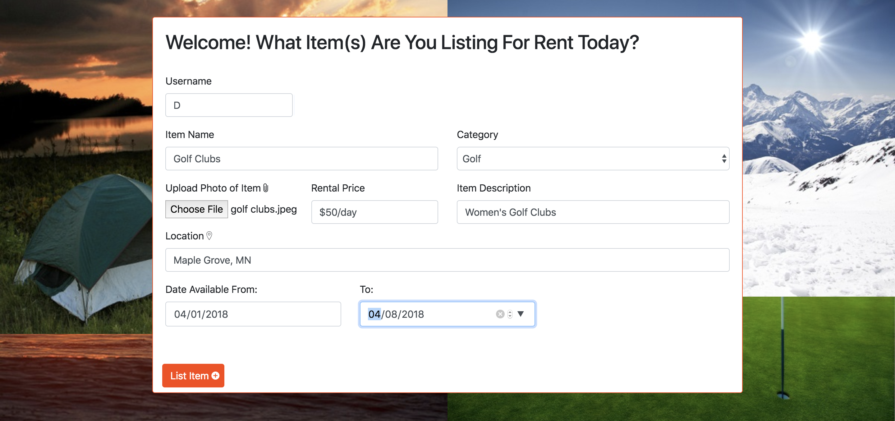
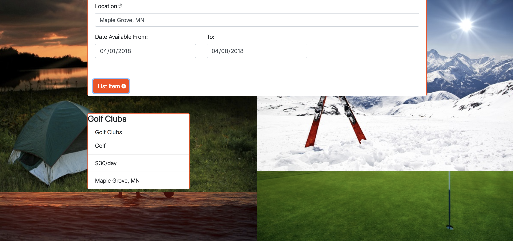

# rental_app
Group Project #2

## 1. Home Page
Use the drop down menu to select if you are a renter looking for an item or an owner wanting to list an item.

## 2. User View
If you selected a renter, you are taken to the rental search page, where you can input the below search parameters for the item you are looking for:
1. Item type
2.  Category
3.  Distance from location
4.  Location
5. Dates needed

Once the search button is clicked, items that match the entered criteria will display below the search box.

Clicking the rent button will take you to a confirmation of page where you are asked "Are you sure you want to rent this item?"

Clicking yes leads to a request being sent to the owner. Click no returns the user to the search form/results page.

## 3. Owner View
If you selected an owner, you are taken to the owner page where you are first prompted to enter your username.

If your username is not yet in the system, an invalid username message will appear along with a close button and a create new user button.

After creating a new user or entering a valid username owners are taken to a form to list their item with the following parameters:
1. Username
2. Item Type
3.  Category
4. Photo upload
5. Rental Price
6. Item Description
7. Location
8. Dates Available

Once the list item button is clicked the information for the entered item is listed below the search form with all other items the owner has listed on the site.

## NPMs Used
This webapp requires the use of the following npms:
* Body-parser
* Express
* Express-Handlebars
* MySQL
* MySQL2
* Path
* Mocha
* Chai
* Nightmare
